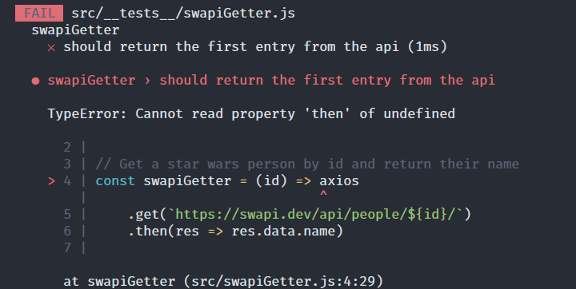

Mocking is a fundamental skill in testing. It allows you to avoid testing parts of your code that are outside your control, or to get reliable return values from said code. It also allows you to avoid running code that a test environment is not capable of running. One of the most common situations that are desirable to mock is making network requests to an API, such as with axios.

Because I remember struggling with this concept myself, and because I encounter the question often enough, I decided that's what I'll cover in this article. The following examples will work for any asynchronous code, though.

_Note: I've included the final test code at the bottom of the article for anyone using this as a quick reference. For I am kind._

## The Code

Let's start with a really simple example of a function that makes a call to <a href="https://swapi.dev/" target="_blank" rel="noopener noreferrer">swapi.dev</a>, a fun test API with all sorts of relational data. All this code does is fetch and return a person's name by id.

```js
import axios from "axios";

// Get a star wars person by id and return their name
const swapiGetter = (id) =>
  axios.get(`https://swapi.dev/api/people/${id}/`).then((res) => res.data.name);

export default swapiGetter;
```

_Note: We should have a `.catch` chain here for any problems we encounter with the request, but I'm trying to keep the example minimal for now._

Here is our test file for the previous code. It contains a describe block with a single test. Describe blocks are useful for grouping a set of tests for the output of running tests.

```js
import swapiGetter from "../swapiGetter";

describe("swapiGetter", () => {
  test("should return the first entry from the api", () => {
    const result = swapiGetter(1);
    // I've added this for troubleshooting
    console.log(result);
    expect(result).toBe("Luke Skywalker");
  });
});
```

This test simply requests the person's name with id 1, and then expects that to be the returned value. When I run this test, the test will fail. I've added the `console.log` to help show why.

<figure>
  </img>
</figure>

If we are running asynchronous code, we need to wait for it. I included this failure because it comes up rather often when people encounter `undefined` from their test and think that their mock is not working correctly. I wanted to show that without mocking in the mix, this is a common culprit. It's really common for me, and I know other coders, to look first to the new technology or tool they are using as the reason something is not working, when often it is something we already know and would be obvious if we weren't trying out something foreign.

You can use `.then` chains or `async await`, but in my tests I prefer `async await`.

```js
// highlight-next-line
test("should return the first entry from the api", async () => {
  // highlight-next-line
  const result = await swapiGetter(1);
  expect(result).toBe("Luke Skywalker");
});
```

Now our tests will pass, which is fantastic, but they are making calls to axios which we don't want. We really shouldn't be hitting their servers every time we have a test, and what if they are temporarily down or we have a network issue ourselves? What if the API we are hitting changes its data for whatever reason? What we really want is to simulate hitting the API and return consistent data for our tests. In comes the mock!

## Mocking Axios

To automatically mock an import in jest, you can simply call `jest.mock`. You pass to it the same string you would when importing a module.

```js
jest.mock("axios");
```

Sometimes this is sufficient, as it will replace the default export of that module with a function that returns nothing. If we run our test again this is what we see:

<figure>
  </img>
</figure>

In our `swapiGetter` function we call `axios.get`, so we need to mock that method from the module. In order to do this we need to import `axios` into our test file, but we'll change the name to `mockAxios` to make it clear that we are mocking this import locally. With that imported, we can mock the method:

```js
import swapiGetter from "../swapiGetter";
// highlight-next-line
import mockAxios from "axios";

jest.mock("axios");
// highlight-next-line
mockAxios.get.mockImplementation(() => Promise.resolve());
//...
```

Running this test will get us a little further, but we actually need to return some data or we will receive something like this:

<figure>
  </img>
</figure>

The `res` (response) variable we are looking for in our `.then` callback is `undefined` and therefore we cannot get `data.name` off it. Alright, that's an easy fix:

```js
mockAxios.get.mockImplementation(() =>
  Promise.resolve({ data: { name: "Jimmy Jedi" } })
);
```

I'm changing the data to match the shape of what I expect returned in the most minimal fashion for my purposes. And I'm changing the `name` value to something made up so I know it is from my mock axios and not a real request. This means I need to change my test's expected name value.

```js
expect(result).toBe("Jimmy Jedi");
```

Super cool. Everything is passing beautifully now. We still need the await, of course, because it's a promise, even though we instantly resolve it.

## mockResolvedValue

Now that we are passing it's time for a tiny refactor. We can shorten our mock implementation to:

```js
mockAxios.get.mockResolvedValue({ data: { name: "Jimmy Jedi" } });
```

Since this is such a common thing to do, Jest has a nice alias for it. Just to be clear, these are equivalent:

```js
// example a
mockAxios.get.mockImplementation(() =>
  Promise.resolve({ data: { name: 'Jimmy Jedi' } })

// example b
mockAxios.get.mockResolvedValue({ data: { name: 'Jimmy Jedi' } })
```

## Ensuring the mocked function was called

We can add an extra layer of assurance that we called the mocked function, and that it was only called the amount of times we expect, with another `expect`. To do this, we can use the imported `mockAxios` we added early and check that it was called.

```js
expect(mockAxios.get).toHaveBeenCalledTimes(1);
```

It is generally considered better to use `toHaveBeenCalledTimes(1)` over `toHaveBeenCalled()` because it is more specific. You not only know that your function was called, but the number of times it was called.

While we are making sure our mock is called, we can actually put a `console.log` in our original code temporarily to see the mocked function.

```js
import axios from "axios";

const swapiGetter = (id) =>
  // highlight-next-line
  console.log(axios) ||
  axios.get(`https://swapi.dev/api/people/${id}/`).then((res) => res.data.name);
```

Which will output:

```js
 console.log src/swapiGetter.js:4
    [Function: wrap] {
      _isMockFunction: true,
      getMockImplementation: [Function],
      mock: [Getter/Setter],
      mockClear: [Function],
      mockReset: [Function],
      mockRestore: [Function],
      mockReturnValueOnce: [Function],
      mockResolvedValueOnce: [Function],
      mockRejectedValueOnce: [Function],
      // and so much more ...
```

This is really valuable for sanity checks that your mock is working correctly. We can see a few interesting methods living on this function as well. Hmmmm.

## Clearing Mock State

You could end it here, satisfied that your tests are working, but you actually have a bomb waiting to burn your future self or the next person that makes a test for this file.

To show this, let's copy our previous test and run it again with a different name.

```js
test("should return the first entry from the api", async () => {
  const result = await swapiGetter(1);
  expect(result).toBe("Jimmy Jedi");
  expect(mockAxios.get).toHaveBeenCalledTimes(1);
});
// New Failing Test
// highlight-start
test("duplicate of first test", async () => {
  const result = await swapiGetter(1);
  expect(result).toBe("Jimmy Jedi");
  expect(mockAxios.get).toHaveBeenCalledTimes(1);
});
// highlight-end
```

<figure>
  </img>
</figure>

Well that is unfortunate, and may really cause some headaches to the unsuspecting. This is due to the fact that mocks have internal state for tracking how many times they've been called, what arguments have been passed to them, and other things.

To fix this, we can take advantage of the handy `beforeEach` and `afterEach` functions supplied by Jest and pass `jest.clearAllMocks` which is another handy utility function for clearing mocked instances.

```js
describe('swapiGetter', () => {
  // highlight-next-line
  afterEach(jest.clearAllMocks)
```

This will cause our tests to pass, and we can delete the duplicate test now that we've saved the future universe from certain collapse. Here is the final version of the test file.

## Complete Test Code

```js
import swapiGetter from "../swapiGetter";
import mockAxios from "axios";

jest.mock("axios");
mockAxios.get.mockResolvedValue({ data: { name: "Jimmy Jedi" } });

describe("swapiGetter", () => {
  afterEach(jest.clearAllMocks);

  test("should return the first entry from the api", async () => {
    const result = await swapiGetter(1);
    expect(result).toBe("Jimmy Jedi");
    expect(mockAxios.get).toHaveBeenCalledTimes(1);
  });
});
```

That's all for this one.
