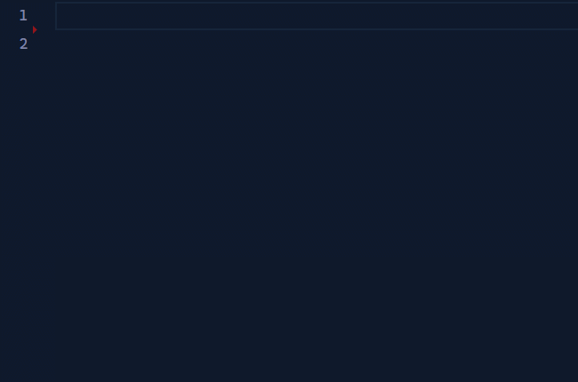

1.6.0 of my VS Code extension, [JS - Snippet Good!](https://marketplace.visualstudio.com/items?itemName=jimmydc.js--snippet-good) is out today, with some React Hook snippets.

The [CHANGELOG.md](https://github.com/Jimmydalecleveland/js--snippet-good/blob/master/CHANGELOG.md) has notes of the changes and any new snippets.

<figure>
  </img>
</figure>

What I thought would be a quick update became a very ..._interesting_ challenge. While setting up snippets for the hooks I use the most, I had a thought that it would be cool if the 2 values that come back from `useState` could be typed at once. This would be trivial if the 2nd didn't need to be transformed to a camelCase version of the first (e.g. `loading, setLoading`).

I did some searching and found out VSCode's snippet language does support regexp captures and transforms. It's a little weird at first because you have to press tab to see the transform, but it works. It did not work for me, though. I thought every example I found online was incomplete or I was using it weirdly/incorrectly.

The problem ended up being the "Vim" extension for VSCode, which I use. It's always had issues with multicursor placeholders, but it had even more strange behavior that made me not suspect it. For some strange reason, starting a snippet out with no placeholder test, or backspacing (Ctrl+backspace works on multicursor in Vim, btw) the placeholder text would cause the transform not to take effect. So I thought my regexp or snippet format was wrong for the longest time.

I never figured it out, alas, and multicursor placeholder support is one of my great complains about the "Vim" plugin but I like the rest of the features too much to remove it. So I just left the snippet in for all the non-vim users.

If you are interested in a code example, here is the single line `useState` statement snippet:

```json
"const [${1:state}, set${1/(.*)/ }] = useState($2)"
```

_**Note**: The third `${1` is actually not a placeholder mark, but the results of the first capture. This threw me off when my placeholders were `${3}` and my `${3:/capitalize}/` would just delete the letter I was trying to capitalize_

I had trouble finding this but the VSCode docs have a [little example](https://code.visualstudio.com/updates/v1_25#_snippet-placeholder-transformations), showing an English to German translation. I used this as a sanity check to branch from when experimenting with different transforms, so it might be useful if you find yourself trying transforms out for the first time.

There is also a handy [little diagram](https://code.visualstudio.com/docs/editor/userdefinedsnippets#_variable-transforms) showing how the expression breaks apart, including a capture.

I might make a future post on using tranforms in snippets some day, since the information is a little spread out and not as clear as I'd prefer. That's all for today, though.
