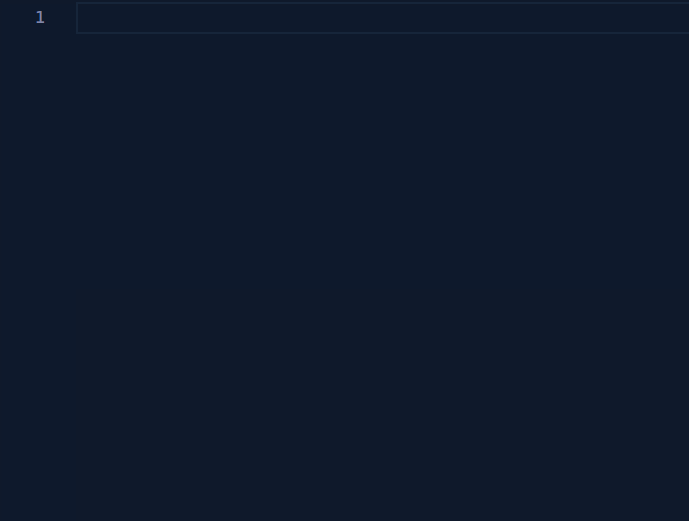

I just released version 1.5.0 of my VS Code extension: [JS - Snippet Good!](https://marketplace.visualstudio.com/items?itemName=jimmydc.js--snippet-good)

As usual, you can check the [CHANGELOG.md](https://github.com/Jimmydalecleveland/js--snippet-good/blob/master/CHANGELOG.md) for some quick notes of the changes.

I've been doing a lot of testing lately at work, and after updating to the latest version of [React Testing Library](https://github.com/testing-library/react-testing-library) (switching to `@testing-libary/react` from the old `react-testing-libary` package) I decided to update a couple RTL snippets and add a couple expect snippets.

Here's the `rtlbs` snippet in action.

<figure>
  </img>
</figure>

_Note: I don't worry about a self-closing version of the JSX component because my linter will take care of that if no children are passed_

I've also added a snippet for the `shape` PropType for the react `prop-types` package. `ptsh` and `ptshr` (`r` on the end for `isRequired` as usual) are how you access it. I've been meaning to add this for awhile, but kept forgetting.

I'll be adding more testing snippets from `jest`, `jest-dom`, and `@testing-libary/react` soon once I decide how I want them.
