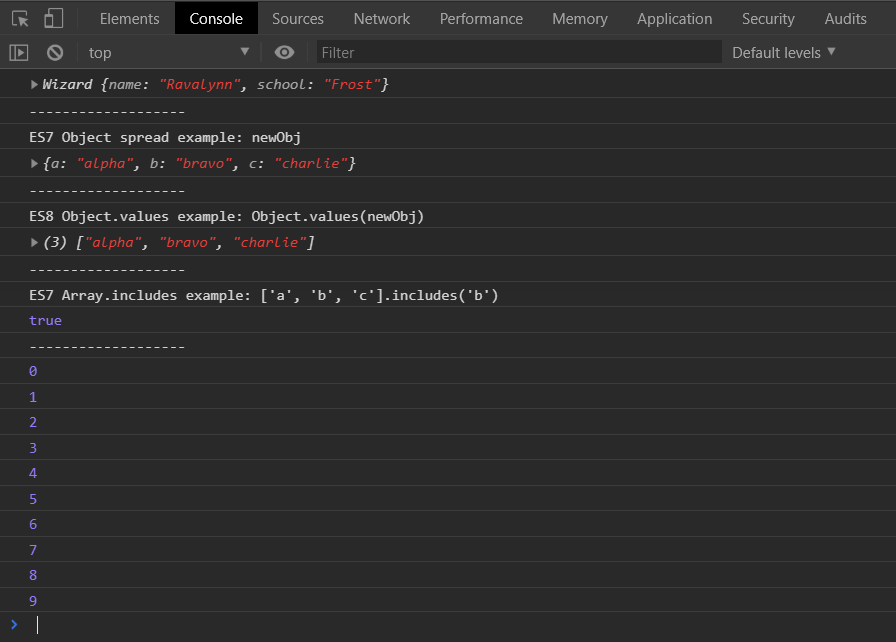
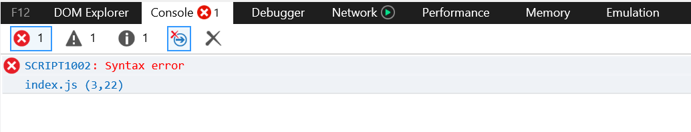
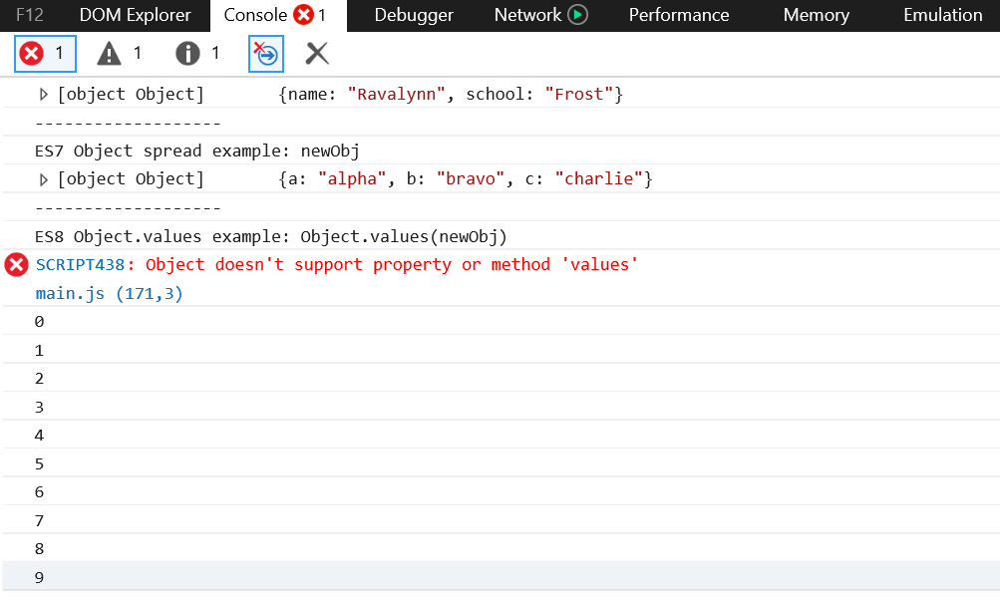
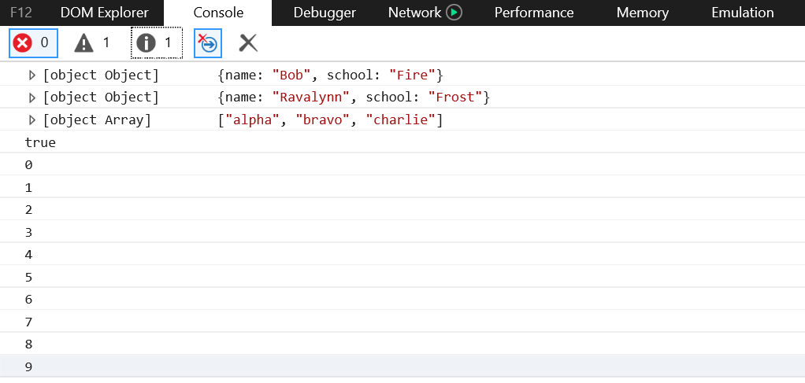

When I have researched this topic in the past I have been unsatisfied by the explanations and documentation surrounding the subject. I'm hoping to clarify some seemingly common confusion points, as well as showcase some minimal configurations to get immediate savings on your final output bundle.

We'll also be taking a peek under the hood of what happens for some ES6+ transpiled syntax to demystify a few things. Just knowing a little bit of what is going on in the tools I use helps alleviate some of the anxiety I have about things that are "just magic" to me, and often gives me additional places to look during troubleshooting.

### The setup

The source for the starting point of this article can be found [here](https://github.com/Jimmydalecleveland/webpack4-setups/tree/esnext). This repository is a collection of minimal Webpack setups, each on their own branch, that I use as a reference for myself and explaining to others.

_Note: Normally you wouldn't push up your `dist` or distribution/public folder, but since this repo is for examples, I sometimes want to be able to reference the output without cloning down and building._

### Let's get into it

To begin with, we have a simple setup using Webpack and Babel to bundle and transpile a couple of small files that use syntax and methods from a few different ES versions after ES5. This is commonly referred to as ES2015+, or ES6+. You can reference the repo I linked above for the config files if you like, but I'm only going to show snippets of the pertinent code throughout this article.

From this point on I'll be referring to the original, pre-transpiled code by the directory and filename: `src/index.js`. The transpiled output will be `dist/main.js`.

This is the file we wish to transpile. It has some examples of newer syntax, such as `import`, arrow functions, `let` and `const`, and the spread operator on an Object, as well as a few methods: `Object.values` and `Array.includes`. We'll get into the reason why I make the distinctions between syntax and methods a little later. We'll also get into the reason for the `for` loop later. You don't need to understand everything about it right now, because I'll be referring to lines from it as we break it down. It's just here upfront for reference.

```javascript
// src/index.js

import Wizard from "./Wizard";

const Ravalynn = new Wizard("Ravalynn", "Frost");
console.log(Ravalynn);
console.log("-------------------");

const component = () => {
  let element = document.createElement("div");
  const obj = { a: "alpha", b: "bravo" };

  // ES7 Object spread test
  const newObj = { ...obj, c: "charlie" };
  console.log("ES7 Object spread example: newObj");
  console.log(newObj);

  // ES8 Object.values test
  // Will not transpile without babel polyfills because it is a new method
  console.log("-------------------");
  console.log("ES8 Object.values example: Object.values(newObj)");
  console.log(Object.values(newObj));
  console.log("-------------------");
  // ES Array.includes test
  console.log("ES7 Array.includes example: ['a', 'b', 'c'].includes('b')");
  console.log(["a", "b", "c"].includes("b"));
  console.log("-------------------");

  return element;
};

// Event queue block scoping test
for (let i = 0; i < 10; i++) {
  setTimeout(function () {
    console.log(i);
  }, 1);
}

document.body.appendChild(component());
```

After running this code through Babel, we can open it up in a browser and check out the console tab of devtools to see the output.

<figure>
  </img>
</figure>

Everything runs as expected, with no errors. For people brand new to this world, this is where they might stop. But if you change the `index.html` to load the `src/index.js`, rather than the Babelified code, and remove the `import` statement and the associated invocation and log, you would see that the rest of the code works fine.

_Note: If you are curious as to why we need to remove any imports to get it running in chrome, that is because Webpack is taking care of bundling all dependencies into a single file that the browser can load. Browsers don't have a way of dealing with JavaScript imports currently._

In this example I'm using Chrome 72, which supports all the previous code (`import` excluded, as it's a special case). If we were to load this up in IE11, however, we'd see this:

<figure>
  </img>
</figure>

It's failing on line 3 when it encounters the `=>` symbol. If you take a look at [caniuse](https://caniuse.com/#feat=arrow-functions) for ES6 arrow functions, you'll see that IE11 does not support it, so that makes sense.

Let's go back to the original, transpiled setup and see what happens in IE11.

<figure>
  </img>
</figure>

It almost looks like we are back in business, with our `import`, arrow functions, Object spread, `let` and `const` all working... until we hit a snag on the `Object.values` part of our code.

You can see that IE11 does not know what the `Object.values` method is, as it throws this error when encountering it: `Object doesn't support property or method 'values'`.

This is the point where many become frustrated with Babel, saying something to the tune of "I thought preset-env was supposed to include everything from ES2015 and after". I think it's a fair assumption, but I have a bias since I've been there myself. The thing about `present-env` is that it includes all ES6+ _syntax_ but not all the _methods_ that have been added since ES5.

### Let's dive a little deeper

To explain this more clearly, we are going to look at some of the output from Babel. Let's do a before and after of our `Object.values` problem child. Here's the original.

```javascript
// src/index.js

// ES8 Object.values test
// Will not be transpiled without polyfills since it's a new method
console.log(Object.values(newObj));
```

And here is the relevant line in our `dist/main.js`.

```javascript
// dist/main.js

console.log(Object.values(newObj));
```

It's the same as the original line, because it is a new method and that requires a "polyfill", or backwards compatible replacement, in order to make it function correctly. `preset-env` is only for new syntax, and does not include polyfills for entirely new methods.

If we take a look at some new _syntax_, we'll see that actual transpiling is being done by Babel.

```js
// src/index.js

const obj = { a: "alpha", b: "bravo" };

// ES7 Object spread test
const newObj = { ...obj, c: "charlie" };
```

```javascript
// dist/main.js

var obj = {
  a: "alpha",
  b: "bravo",
}; // ES7 Object spread test

var newObj = _objectSpread({}, obj, {
  c: "charlie",
});
```

You'll notice that the transpiled code has taken the spread syntax and replaced it with an `_objectSpread` function. If we look further up in this same file, we'll find this:

```javascript
function _objectSpread(target) {
  for (var i = 1; i < arguments.length; i++) {
    var source = arguments[i] != null ? arguments[i] : {};
    var ownKeys = Object.keys(source);
    if (typeof Object.getOwnPropertySymbols === "function") {
      ownKeys = ownKeys.concat(
        Object.getOwnPropertySymbols(source).filter(function (sym) {
          return Object.getOwnPropertyDescriptor(source, sym).enumerable;
        })
      );
    }
    ownKeys.forEach(function (key) {
      _defineProperty(target, key, source[key]);
    });
  }
  return target;
}
```

Babel has written a function to our output file that all browsers we wish to support can read.

Another example of this can be seen where block scoped variables (`let` and `const`) are involved, as long as they affect the result of the code. Let's take a look at using `let` where the result is not affected, and then an example where it is.

In this first line of code you see that our before and after are almost identical. The `let` variable has simply been changed to `var`. The block scoping property of `let` in this instance doesn't have any impact on our output that would require additional changes.

```javascript
// src/index.js

let element = document.createElement("div");
```

```javascript
// dist/main.js

var element = document.createElement("div");
```

But look at this next block of code. This is a common issue in Javascript that used to require the use of closures to get the desired output (I have a previous post covering [Javascript closures basic concepts](/javascript-closures-basic-concepts/) if you want more information about that). In this case we are wanting to log 0 through 9 as the loop progresses, but without the `let` variable we would get 10 logged 10 times.

This is because `setTimeout`s are placed on the event queue and can't execute until the stack is clear again. The `for` loop will complete, and then each `setTimeout`'s callback will fire at once, referencing `i` which has been incremented to 10.

By using `let` we'll block scope each instance of `i` that the corresponding `setTimeout`'s callback will reference. Check out the before and after.

```javascript
// src/index.js

// Event queue block scoping test
for (let i = 0; i < 10; i++) {
  setTimeout(function () {
    console.log(i);
  }, 1);
}
```

```javascript
// dist/main.js

var _loop = function _loop(i) {
  setTimeout(function () {
    console.log(i);
  }, 1);
};

for (var i = 0; i < 10; i++) {
  _loop(i);
}
```

It seems that Babel has "intelligently" realized that our use of `let` will effect our desired output, so it creates a new function, `_loop`, to create a closure for each `setTimeout` so they can access `i` relative to when they are called.

Both of the previous examples were syntax additions to JavaScript so they will work without polyfills. The `Object.values` and `Array.includes` will not be transpiled to anything different, as they are not just syntax, but entirely new methods.

### Why not just include the polyfills by default?

Sometimes this question comes up when someone's code is failing on older browsers and they expected `preset-env` to include everything ES6+. The simple answer is that that would create a **much** larger file. I'll throw out some relative numbers to this example to hopefully show how much larger that file can be. The unminified version of our `dist/main.js` is 196 lines, and the minified size is 2.55KiB. The unminified version, using polyfills, is over 9000 (9815 in this case). That's 83.9 KiB minified!

That is obviously a TON of code for our end user to download. Any developers not wanting to support every browser under the sun would not want to be forced into this situation.

If you are using Webpack, you can add all polyfills by installing the `@babel/polyfill` package and updating your entry point in your `webpack.config.js` like so:

```js
// webpack.config.js

module.exports = {
  entry: ['@babel/polyfill', './src/index.js']
  // ...
```

Babel recommends you select each polyfill you need, rather than adding every polyfill that exists like the above example is doing, and now you know why.

After adding polyfills, IE11 runs our code without errors.

<figure>
  </img>
</figure>

### Why not automatically add polyfills for methods my code _actually_ uses?

In the `.babelrc` file, you can add the `useBuiltIns` option with the `usage` value to only add polyfills which your codebase uses. This is flagged as `experimental` in the Babel docs (as of March 2019). If you do this, do not add `@babel/polyfill` in your webpack entry point. You still need to have `@babel/polyfill` installed, but you shouldn't require it anywhere in your codebase. Here's an example of the `.babelrc`:

```js
// .babelrc

{
  "presets": [["@babel/preset-env", { "useBuiltIns": "usage" }]]
}
```

The result of this build gives us a much smaller filesize, compared to adding all polyfills: 1512 lines unminified and 12.3 KiB minified.

That's all for now, but in the next article I'll be going into browserslist configurations and how you can narrow down which browsers you want your transpiling to support.
