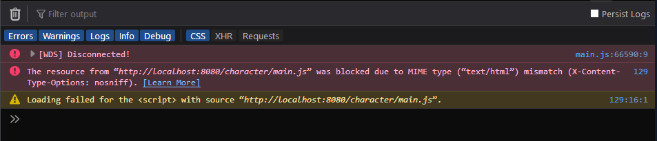
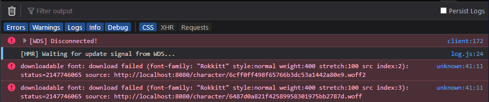

If you are using React Router for your SPA (Single Page App) routing, and are running into a problem where hitting a url directly fails to load your route, there is a relatively simple solution if you are using the `webpack-dev-server` package for development. In your webpack config file, add the `devServer` root level property, set to an object with `historyApiFallback: true` like so:

```js
module.exports = {
  // standard webpack stuff
  // ...

  // add the next 3 lines
  // highlight-start
  devServer: {
    historyApiFallback: true,
  },
  // highlight-end
};
```

<a href="https://webpack.js.org/configuration/dev-server/#devserverhistoryapifallback" target="_blank" rel="noopener noreferrer">Check the docs for more info on this property here</a>.

This has usually taken care of the problem simply enough for me, but I ran into some new problems yesterday that were not easy for me to find a fix for.

### Error: resource was blocked due to MIME type

When clicking through to a route using `<Link>` tags, everything loads correctly. But if I refreshed the page or entered the url manually, I received a blank page and the following error.

<figure>
  </img>
</figure>

`The resource from “http://localhost:8080/character/main.js” was blocked due to MIME type (“text/html”) mismatch (X-Content-Type-Options: nosniff).`

The issue is somewhat obvious in hindsight, as it often is, but all I needed to do was update my `index.html` script for my app. My webpack bundle file is named `main.js`, so the update looks like so:

```html
<!-- Before -->
<script src="main.js"></script>

<!-- After (prefix with slash so it doesn't look for this asset relatively)-->
<!-- highlight-next-line -->
<script src="/main.js"></script>
```

Thanks to this <a href="https://github.com/ReactTraining/react-router/issues/676#issuecomment-160249067" target="_blank" rel="noopener noreferrer">Github Issue from BenFlanagan</a>, I realized my folly. This fixes the previous issue, but I had another waiting for me.

### Error: downloadable font: download failed

<figure>
  </img>
</figure>

`downloadable font: download failed (font-family: "Rokkitt" style:normal weight:400 stretch:100 src index:2): status=2147746065 source: http://localhost:8080/character/6cff0ff498f65766b3dc53a1442a80e9.woff2`

Again, we see a familiar pattern. The browser is trying to access the woff2 file relative to our url path. For this one we need the `publicPath` property, which lies on the `output` object in webpack configs. You actually don't need an `entry` or `output` for minimal webpack configs, but now we'll have to add that.

```js
module.exports = {
  entry: "./src/index.tsx",
  output: {
    filename: "main.js",
    path: path.resolve(__dirname, "dist"),
    // highlight-next-line
    publicPath: "/", // required for font loading on historyApiFallback
  },

  // ...
};
```

And with that, all my issues were solved. I hope this helps anyone stuck on this issue in the future. Best of fortune to you.
